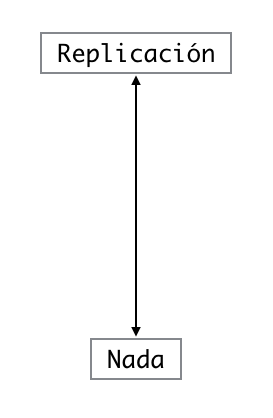
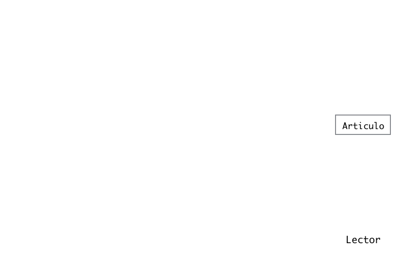

## Replicación

- La norma estándar para reforzar la evidencia científica es la replicación de
conclusiones y la realización de estudios con independientes actores 

   + Investigadores 
   + Datos 
   + Métodos analíticos 
   + Laboratorios 
   + Instrumentos 
    
- La replicación es particularmente importante en estudios de gran impacto social y de generación de políticas publicas 

---

## Que pasa con la replicación?

- Algunos estudios no pueden ser replicados 

   + Por tiempo
   + Dinero 
   + Únicos 

- **_Investigacion reproducible_**: Hacer que los datos analíticos y el código estén disponibles para que otros puedan reproducir los resultados

---

## Como podemos cubrir la brecha ?

<center>  </center>

---


##  Como podemos cubrir la brecha ?

<center>  </center>

---

## Por que necesitamos la investigación reproducible?


- Las nuevas tecnologías aumentan el rendimiento de la recopilación de datos; los datos son cada vez más complejos y de dimensiones extremadamente grandes.

- Las bases de datos existente se pueden fusionar para crear "mega bases de datos"

- El poder computacional ha aumentado considerablemente, permitiendo análisis mucho mas sofisticados 

- Por cada campo "$X$", existe un campo "$X$ Computacional"  

---

## Ruta de la investigación 

<center>  </center>

---

## Ruta de la investigación 

<center>  </center>

---

## Recientes desarrollos 

<center>  </center>

---

## Noticias  

<center>  </center>

---

## Que se necesita?

- Análisis de datos este disponible 
- Código analítico este disponible 
- Documentación de código y datos 
- Medios de distribución estándar

---


## Quienes son los actores?

- Autores 
   + Quieren que sus investigaciones sean reproducibles 
   + Quieren herramientas para la "IR", hacer su trabajo más fácil 

- Lectores 
   + Quieren reproducir resultados interesantes 
   + Quieren herramientas para "IR", hacer su trabajo fácil 

---


## Retos 

- Los autores deben hacer esfuerzos considerables para poner datos y/o resultados en la web 

- Los lectores deben descargar esa información de la web individualmente y ponerlos juntos

- Los lectores quizá no tengan los mismos recursos que los autores 

- Solo unas pocas herramientas ayudan a estas tareas para autores y lectores

---


## En la realidad ...

- Autores 
   + Solo suben material a la web 
   + Existen algunas bases de datos para varios campos 
   
- Lectores 
   + Solo descargan datos y tratan de deducir 
   + Juntan piezas de códigos y corren para ver que sucede 

---


## Literate (Statistical) Programing

- Un articulo es un flujo de **texto** y **código** 
- El análisis del código es dividido entre texto y "_chunks_" de códigos
- Cada "_chunks_" carga datos y calcula resultados
- Los resultados tiene distintos formatos de presentación (Tablas, figuras, etc.)
- El texto del articulo explica que esta sucediendo 
- Los _Literate programs_ pueden ser concebidos para producir documentos legibles para humanos y embebidos para ser computacionalmente legibles. 

---

## Literate (Statistical) Programing

- _Literate statistical programing_ es en general un concepto que requiere 
   + Un lenguaje de documentación (legible para humanos)
   + Un lenguaje de programación (legible para maquinas)
- `Sweave` utiliza $\LaTeX$ y $R$ como lenguajes de documentación y programación 
- `Sweave` fue desarrollado por _Friedrich Leisch_ (miembro del R core) 

---

## Limitaciones de `Sweave`

- `Sweave` tiene muchas limitaciones 
- Se centra principalmente en el uso de $\LaTeX$ 
- Le faltan ciertas características como capturas, gráficos múltiples por "chunks", mezcla de lenguajes de programación y muchos otros items técnicos
- No es actualizado con frecuencia

---

## Literate (Statistical) Programing

- `knitr` es un paquete escrito en $R$ surge como una alternativa 
- Reúne muchas características para abordar las limitaciones de `Sweave` 
- `knitr` usa principalmente $R$ como lenguaje de programación y una variedad de lenguajes de documentación 
   + `HTML`, `Markdown`, $\LaTeX$
- `knitr` fue desarrollado por _Yihui Xie_ (Estudiante de posgrado en _Iowa State_)

--- 

## Códigos y gráficos 

```{r, results = 'asis', message=FALSE, warning=FALSE, fig.align='center', fig.height=250}
require(rCharts)
haireye = as.data.frame(HairEyeColor)
n1 <- nPlot(Freq ~ Hair, group = 'Eye', type = 'multiBarChart', 
            data = subset(haireye, Sex == 'Male')) ; n1$print('chart1')
```

--- 

## Formulas y gráficos 

$$
    \begin{equation}
f(x) = \frac{1}{\sqrt{2\pi\sigma^2}}e^{-(x-\mu)^2/2\sigma^2}
\end{equation}
$$


```{r, echo=FALSE, fig.align='center', fig.height= 4, fig.width= 8, message=FALSE, warning=FALSE}

require(ggplot2)
x <- seq(-4, 4, 0.1)
y <- dnorm(x)
df <- data.frame(x, y)
df2 <- data.frame(x1 = 0, x2 = 0, y1 = 0, y2 = 0.4)
df3 <- data.frame(x1 = 0, x2 = 1.15, y1 = 0.2, y2 = 0.2)

p <- ggplot(df, aes(x=x, y=y)) + geom_line() + geom_polygon(alpha = 0.2)
p + geom_segment(aes(x = x1, y = y1, xend = x2, yend = y2), 
                 linetype = 2, data = df2) + geom_segment(aes(x = x1, y = y1, xend = x2, yend = y2), 
                 linetype = 1,arrow = arrow(length = unit(0.2, "cm"), 
                                            ends = "both"), data = df3) + annotate('text', x = 0.6, y = 0.18, label = "sigma",parse = TRUE,size=4.5) + theme_bw() + theme( panel.border = element_blank(),  panel.grid.minor = element_blank(), axis.line = element_line(colour = "black"))+ xlab(expression(mu)) + ylab('')

```

---
